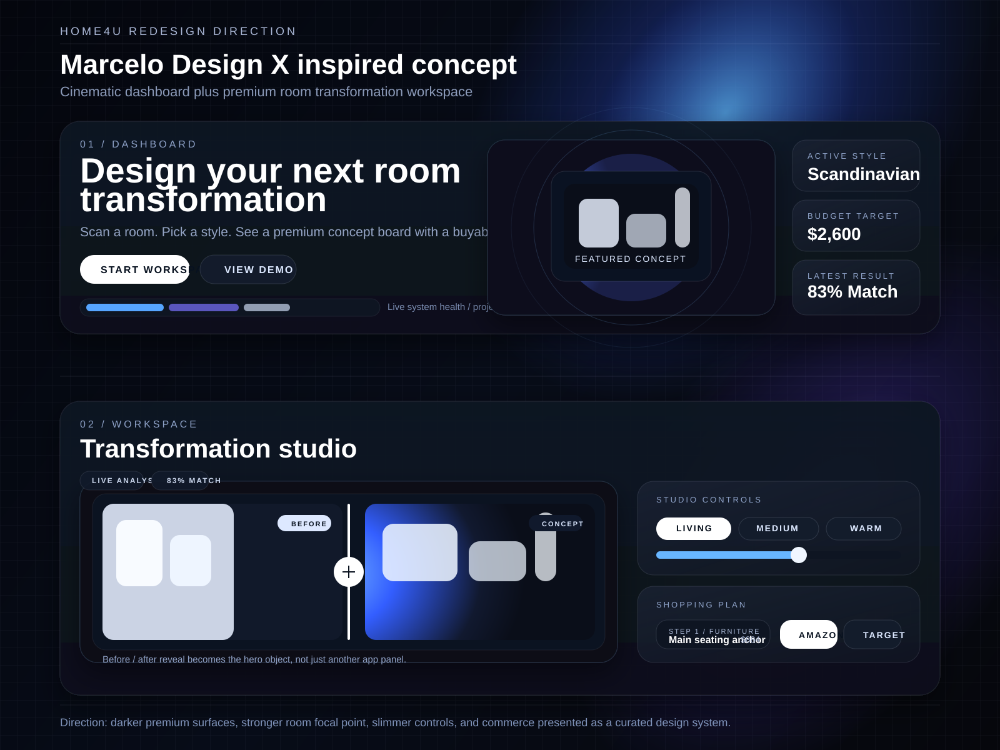
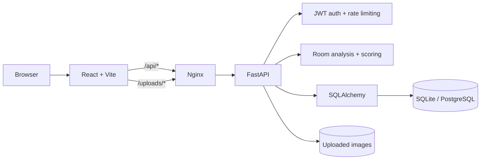

# Home4U

**A data-driven room transformation planner for renters and first-time apartment dwellers.**

[](https://github.com/calebponce/Home-4-U/actions/workflows/app-quality.yml)
[](LICENSE)
[](application/frontend)
[](application/backend)

Home4U turns room inspiration into an actionable plan. A user creates a room project, uploads a photo, selects a target design style and budget, and receives an explainable comparison with prioritized recommendations that can be saved and refined.

> **Portfolio status:** The application and automated tests are available in this repository. The former public demo is temporarily unlisted while its TLS configuration is repaired.



_Product design concept illustrating the dashboard and transformation workspace._

## Product flow

1. Create an account and a room project.
2. Select a target style, room type, and budget.
3. Upload a room image or use a sample room.
4. Analyze room signals and compare them with structured style definitions.
5. Review style-match scores, a concept board, and budget-aware recommendations.
6. Save the plan and track recommendation completion.

## Engineering highlights

- **Full-stack application:** React 19 and Vite frontend with a FastAPI backend.
- **Explainable recommendations:** deterministic style scoring keeps the primary analysis reproducible and reviewable.
- **Project persistence:** SQLAlchemy models store users, room projects, images, analysis runs, scores, and recommendations.
- **Database evolution:** Alembic migrations support controlled schema upgrades; SQLite is the development default and `DATABASE_URL` enables PostgreSQL.
- **Authentication hardening:** JWT sessions, normalized email handling, production secret validation, and configurable login throttling.
- **Production routing:** Nginx serves the frontend and proxies `/api/*` and `/uploads/*` to the backend.
- **Quality automation:** GitHub Actions runs frontend tests, accessibility/smoke coverage, linting, backend migrations, and API smoke tests.
- **Operational diagnostics:** request IDs, response-time headers, health checks, and persisted analysis history support debugging and QA.

## Architecture



The frontend and production proxy share the same public contract: browser requests use `/api/*`, while the backend exposes unversioned routes internally. See [PROJECT_DOCUMENTATION.md](PROJECT_DOCUMENTATION.md) for the generated endpoint and runtime inventory.

## Repository layout

```text
application/
├── backend/       FastAPI routes, services, models, migrations, and tests
├── frontend/      React application, styles, and UI tests
├── deployment/    Nginx, systemd, and deployment scripts
└── credentials/   Safe credential-handling policy (no live credentials)
docs/               Product design artifacts
milestones/         Archived course deliverables and project history
```

## Run locally

### Prerequisites

- Python 3.12
- Node.js 18 or newer
- npm

### Backend

```bash
cd application/backend
python3 -m venv .venv
source .venv/bin/activate       # Windows: .venv\Scripts\activate
pip install -r requirements.txt
python seed.py                  # seeds styles; demo users are opt-in
python -m uvicorn app.main:app --host 127.0.0.1 --port 8000
```

The API is available at `http://127.0.0.1:8000`; interactive documentation is at `http://127.0.0.1:8000/docs`.

### Frontend

```bash
cd application/frontend
npm ci
npm run dev -- --host 127.0.0.1 --port 5173 --strictPort
```

Open `http://127.0.0.1:5173`.

## Tests and quality checks

```bash
# Frontend
cd application/frontend
npm ci
npm test
npm run lint

# Backend
cd ../backend
pip install -r requirements.txt
./run_smoke_tests.sh
```

The CI workflow also upgrades a fresh SQLite database through every Alembic migration before running backend smoke tests.

## Configuration

The application runs locally with safe development defaults. Production deployments should provide secrets outside the repository.

| Variable | Purpose |
|---|---|
| `DATABASE_URL` | Optional relational database connection; defaults to SQLite locally |
| `HOME4U_SECRET_KEY` | Required secret for production JWT signing |
| `HOME4U_CORS_ORIGINS` | Optional comma-separated direct backend origins |
| `HOME4U_DATA_DIR` | Persistent production data directory |
| `HOME4U_UPLOAD_DIR` | Uploaded-image storage location |
| `HOME4U_MAX_UPLOAD_BYTES` | Maximum upload size |
| `VITE_API_BASE` | Frontend API base; defaults to `/api` |

See [application/README.md](application/README.md) for the full configuration and migration reference.

## My contribution

I served as **Team Lead and System Architecture lead**. In addition to coordinating delivery and maintaining the engineering documentation, my commits covered protected workspace flows, authentication and health hardening, migration/deployment automation, room-analysis diagnostics, scoring and recommendation UX, and post-demo product improvements.

This was a five-person CSC 648/848 software-engineering project. The complete team history is intentionally preserved so individual and collaborative contributions remain attributable.

## Team

- [Caleb Ponce](https://github.com/calebponce) — Team Lead / System Architecture
- [Mason Lee](https://github.com/mlee82) — Data Modeling / Scoring Engine
- [Christopher Quach](https://github.com/rexchris2) — Frontend Development
- [Tyler Morris](https://github.com/tylerrendon) — Backend / AI Integration
- [Dias Almat](https://github.com/vincivv) — Technical Writing

Originally developed in the [SFSU course repository](https://github.com/sfsu-joseo/Home4U). Course milestones remain under [`milestones/`](milestones/) as an engineering record, but they are not required to run the application.

## License

This project is available under the [MIT License](LICENSE). Contributor attribution is preserved in the Git history.
